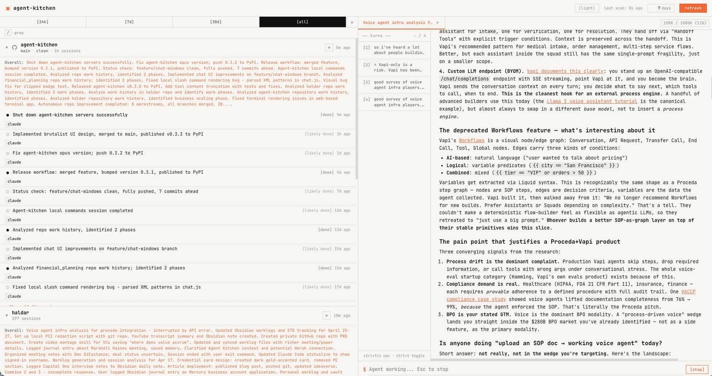

# Agent Kitchen

**Like browser history for your Claude Code sessions.**

<p align="center">
  
</p>

You run dozens of Claude Code and Codex sessions a day. Which repos have active work? What was that session doing? Where did you leave off yesterday?

Agent Kitchen gives you a single dashboard for all of it — sessions grouped by repo, LLM-generated summaries, live git status, and one-click resume.

```bash
# One command. No install needed.
uvx agent-kitchen web
```

## Why

AI coding agents don't have a "recent projects" view. Your session history is scattered across hidden JSONL files. Switching between repos means losing context on what you were doing elsewhere.

Agent Kitchen fixes this by scanning your local session data, grouping everything by git repo, and surfacing what matters:

- **What's active** — sessions sorted by recency, status badges (done, in progress, waiting)
- **What changed** — per-repo timeline showing work evolution over days
- **What's dirty** — live git status (branch, uncommitted changes, unpushed commits)
- **What it was about** — LLM-generated one-line summaries via Claude Haiku

## Features

- **Unified view** — Claude Code and Codex CLI sessions in one place, grouped by repo
- **Rich chat view** — click any session to see a rendered conversation with markdown, code highlighting, and collapsible tool calls
- **Live agent interaction** — send messages to agents directly from the browser via the Agent Client Protocol (ACP)
- **LLM summaries** — one-line descriptions and status classification (done / in progress / waiting)
- **Live git status** — current branch, dirty files, unpushed commits per repo
- **Repo timelines** — see how work evolved across sessions over days
- **Browser terminal** — resume sessions in-browser via xterm.js (fallback mode)
- **Fuzzy search** — press `/` to filter across all sessions with command-palette overlay
- **Keyboard navigation** — `j`/`k` to move between groups, `Enter` to expand, `?` for shortcuts
- **Image support** — paste images into chat with preview strip
- **Session lifecycle** — automatic death detection, termination UI, and restart capability
- **Fast startup** — cached summaries load instantly, LLM upgrades happen in the background
- **No build step** — vanilla HTML/JS/CSS, zero npm dependencies

## Quick Start

```bash
# Run directly — no install needed
uvx agent-kitchen web

# Or install it
uv pip install agent-kitchen
agent-kitchen web
```

Opens at `http://localhost:8099`.

## Usage

```bash
# Custom port
agent-kitchen web --port 9000

# Scan further back in history
agent-kitchen web --scan-days 90

# Don't auto-open the browser
agent-kitchen web --no-open

# Enable background LLM summarization
agent-kitchen web --summarize
```

### Pre-indexing summaries

By default, the dashboard shows fallback summaries (the first user message). For LLM-generated summaries, either pass `--summarize` to the web command, or pre-index:

```bash
agent-kitchen index              # Index all sessions from the last 60 days
agent-kitchen index --dry-run    # Preview without LLM calls
agent-kitchen index --force      # Re-index everything, ignoring cache
agent-kitchen index --concurrency 5  # Control LLM concurrency (default: 3)
```

Summaries are cached at `~/.cache/agent-kitchen/summaries.json`.

## Authentication (for LLM summaries)

LLM summaries require a Claude API credential, checked in order:

1. `ANTHROPIC_API_KEY` — standard Anthropic API key
2. `CLAUDE_CODE_OAUTH_TOKEN` — Claude Max subscription token
3. `pass` password manager at `dev/CLAUDE_SUBSCRIPTION_TOKEN`

```bash
export ANTHROPIC_API_KEY=sk-ant-...
agent-kitchen web --summarize
```

Without credentials, the dashboard still works — you just get fallback summaries instead.

## Configuration

| Variable | Default | Description |
|---|---|---|
| `AGENT_KITCHEN_PORT` | `8099` | Server port |
| `AGENT_KITCHEN_SCAN_DAYS` | `60` | Days of history to scan |
| `AGENT_KITCHEN_REFRESH_INTERVAL` | `60` | Background rescan interval (seconds) |
| `AGENT_KITCHEN_TERMINAL` | `ghostty` | Terminal app (`ghostty` or `terminal`) |

## How It Works

**Dashboard pipeline** — scanning and grouping sessions:

```
JSONL session files (~/.claude, ~/.codex)
  → Scanner (parse sessions, filter noise)
  → Git Status (branch, dirty, unpushed)
  → Cache (reuse prior summaries by mtime)
  → LLM Summarizer (Claude Haiku via Agent SDK)
  → Grouping (by repo, sorted by recency)
  → FastAPI server (JSON API + static frontend)
```

**Chat view** — interacting with agents:

```
Browser (chat.js) ↔ WebSocket ↔ FastAPI ↔ ACP agent subprocess
```

When you click a session, the chat panel opens a rich conversation view. Sending a message spawns an agent subprocess using the [Agent Client Protocol](docs/rich-chat-view-design.md), which streams responses back over WebSocket as structured messages (text, tool calls, status updates).

Only interactive sessions are shown. Programmatic SDK sessions (≤1 user turn) and subagent child sessions are filtered out. See [docs/session-formats.md](docs/session-formats.md) for details.

## Development

```bash
git clone https://github.com/haldar/agent-kitchen.git
cd agent-kitchen
uv pip install -e ".[dev]"

uv run pytest                    # Python tests
node --test tests/test_chat.mjs  # Frontend JS tests
uvx ruff check --fix .           # Lint
uvx ruff format .                # Format
```

## Requirements

- Python 3.12+
- macOS (terminal launch uses AppleScript; the dashboard itself works anywhere)
- `~/.claude` and/or `~/.codex` directories with session data
- Node.js (for the chat panel — agents are spawned via `npx` and fetched on first use; no separate global install needed)

## License

Apache 2.0 — see [LICENSE](LICENSE).
